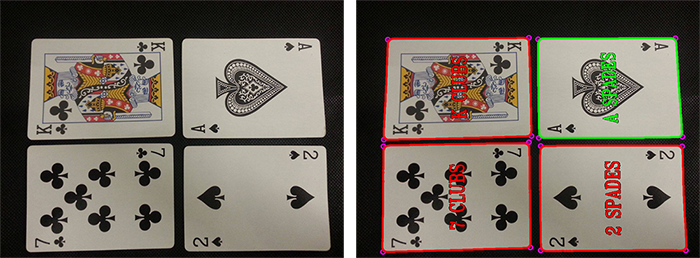

# Augmented Cards

Developed for the class of Augmented Reality (EIC0070) at MIEIC, FEUP. 

> The main objective of this project is the development of an application capable of assisting the playing of a simple card game. The application should be able to acquire an image of the cards played during a round of the game and announce the result, according to the game rules, by augmenting the acquired image with visual information. 

> The application here presented was fully developed in C++ using OpenCV (Open Source Computer Vision) version 2.4. For card recognition, two methods have been implemented: binary absolute difference and SURF (Speeded Up Robust Features). Binary absolute difference attempts to find the lowest number of differences between two images in a pixel by pixel basis, while SURF based detection attempts to find the highest number of matches.

Further info can be found in the [full report](s).

## Examples

## Usage Instructions

The application can acquire images from the file system or from a connected camera. It should be noted that both decks and images should be placed inside an assets folders (path: *../Assets/*) and then referred directly by their name (*e.g., image-sample.png*).

The augmented image will have have both its contours and corresponding rectangle corners drawn, along with information about the match found by the application. The winner (or winners, in case of a tie) will be drawn in green. In the default game mode, the card with the highest value wins (noting that the Jokers have a value of 0). 